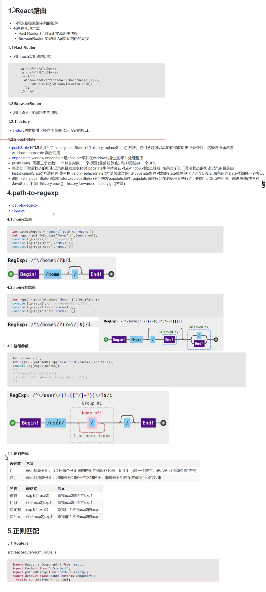

# react-router

## HashRouter路由 代码实例
```
  <!DOCTYPE html>
  <html lang="en">
  <head>
      <meta charset="UTF-8">
      <meta name="viewport" content="width=device-width, initial-scale=1.0">
      <meta http-equiv="X-UA-Compatible" content="ie=edge">
      <title>Document</title>
  </head>
  <body>
     <a href="#/a">跳转到/a</a>
     <a href="#/b">跳转到/b</a>
     <div id="root" style="border:3px solid red;height:200px"></div>
  <script>
  let container = document.getElementById('root');
  window.addEventListener('hashchange',(event)=>{
    //console.log(event);
    //container.innerHTML = event.newURL;
    container.innerHTML = `当前的路径是 ${window.location.hash.slice(1)}`;
  });  

  </script> 
  </body>
  </html>
```
## BrowserRouter路由 代码实例
```
  <!DOCTYPE html>
  <html lang="en">
    <head>
        <meta charset="UTF-8">
        <meta name="viewport" content="width=device-width, initial-scale=1.0">
        <meta http-equiv="X-UA-Compatible" content="ie=edge">
        <title>Document</title>
    </head>
    <body>
    <div id="root" style="border:3px solid red;height:200px">  </div>
    <button onclick="push('/a')">/a</button>
    <button onclick="push('/b')">/b</button>
    <button onclick="push('/c')">/c</button>
    <script>
    let container = document.getElementById('root');
    //监听弹出状态的事件
    window.onpopstate = function(event){
      //console.log(event);
      container.innerHTML= event.state.to;
    }
    window.onpushstate = function(state,title,url){
      //console.log(event);
      container.innerHTML= state.to||url;
    }
    let oldPush = window.history.pushState;
    window.history.pushState = function(state,title,url){
        oldPush.call(window.history,state,title,url);
        window.onpushstate(state,title,url);
    }
    function push(to){
       //pushState 三个参数 新的状态对象 标题(已经废弃) to 跳转到的路径
       window.history.pushState({to},null,to);
    }

    </script>
    </body>
  </html>
```
## context 文件
```
  import React from 'react';
    const context = React.createContext();
  export default context;
```
## HashRouter 手写代码
```
  import React from 'react';
  <!-- import Context from './context'; -->
  export default class HashRouter extends React.Component{
      
      state = {//注意刷新浏览器的时候state没有 为null，点击有state
          location:{pathname:window.location.hash.slice(1),state:null}
      }
      locationState=null
      componentDidMount(){
          window.location.hash = window.location.hash||'/';//默认值就是/
          window.addEventListener('hashchange',()=>{
              this.setState({
                  location:{
                      ...this.state.location,
                      pathname:window.location.hash.slice(1),
                      state:this.locationState
                  }
              });
          });
      }
      
      render(){
          let that = this;
          <!-- HashRouter本质是context上下文，通过value将路由信息传递给子组件 -->
           <!--   根据需求，可以发现，HashRouter可以有history,location，match，属性
           里面可以有这三个属性 -->
          let value = {
              location:that.state.location,
              history:{
                  push(to){//定义一个history对象，有一个push方法用来跳路径
                      if(that.block){
                          let confirm = window.confirm(that.block(typeof to === 'object'?to:{pathname:to}));
                          if(!confirm) return;
                      }
                      if(typeof to === 'object'){
                          let {pathname,state} = to;
                          that.locationState = state;
                          window.location.hash = pathname;
                      }else{
                          that.locationState = null;
                          window.location.hash = to;
                      }
                  },
                  block(message){
                      that.block = message;
                  }
              }
          }
          return (
              <Context.Provider value={value}>
                  {this.props.children}
              </Context.Provider>
          )
      }
  }
```
## Route 手写代码
```
  import React from 'react';
  import RouterContext from './context';
  import pathToRegexp from 'path-to-regexp';
  export default class Route extends React.Component{
      static contextType = RouterContext
      render(){
        <!-- 通过context上下文获得当前浏览器输入的路径名 -->
          let {pathname} = this.context.location;
          <!-- 解构Route组件的属性，其中component，render，childred属性三选一 -->
          let {path='/',component:Component,exact=false,render,children} = this.props;
          <!-- 将浏览器输入的pathname同Route上面的属性path正则对比 
              其中正则由path-to-regexp插件提供。根据match后的结果
              来判断渲染
          -->
          let paramNames = [];
          let regxp = pathToRegexp(path,paramNames,{end:exact});
          let result = pathname.match(regxp);
          let props = {
              location:this.context.location,
              history:this.context.history
          }
          if(result){
              paramNames = paramNames.map(item=>item.name);
              let [url,...values] = result;
              let params = {};
              for(let i=0;i<paramNames.length;i++){
                  params[paramNames[i]] = values[i];
              }
              props.match = {
                  path,
                  url,
                  isExact:url===pathname,
                  params
              };
              if(Component){
                  return <Component {...props}/>
              }else if(render){
                  return render(props);
              }else if(children){
                  return children(props);
              }else{
                  return null;
              }
          }else{
              if(children){
                  return children(props);
              }else{
                  return null;
              }
          }
      }
  }

```