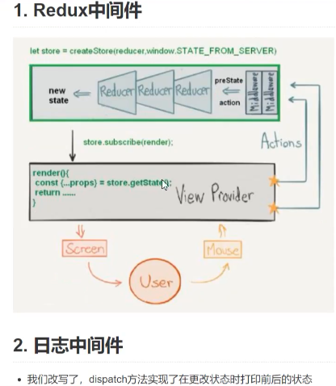
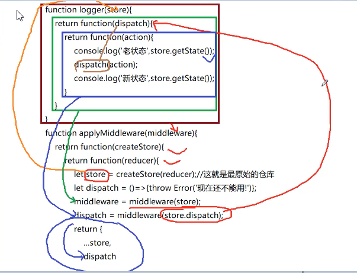
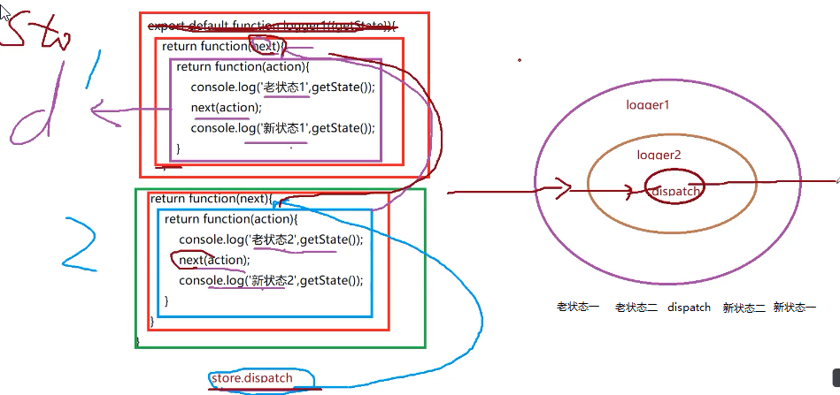

# redux-middleware redux中间件

## 模拟middleware中间件 logger代码
```
  <!-- 注意第二层函数参数为next，表示下一中间件或者dispatch -->
  export default function logger1({store.getState}){
      return function(next){
          return function(action){
              console.log('老状态1',store.getState());
              next(action);
              console.log('新状态1',store.getState());
          }
      }
  }

  export default let logger1 = (store.getState) => (next) => (action) => {
    console.log('老状态1',store.getState);
    dispatch(action)
    console.log('新状态1',store.getState);
  }
```
## 模拟compose函数代码
```
  function add1(str){
      return '1'+str;
  }
  function add2(str){
      return '2'+str;
  }
  function add3(str){
      return '3'+str;
  }
  function compose1(...funcs){
    return function(...args){
      let result;
      /* for(let i=funcs.length-1;i>=0;i--){
        let func = funcs[i];
        result = func(i==funcs.length-1?args:result);
      } */
      let i=funcs.length-1;
      while(i>=0){
        let func = funcs[i];
        result = func(i==funcs.length-1?args:result);
        i--;
      }
      return result;
    }
  }

 <!--  compose函数执行的时候是从右到左 result = add3(),result = add2(result)
  result = add1(result) return result('zhufeng') 同koa2的洋葱模型一样-->
  //let result = compose(add1,add2,add3)('zhufeng');
  //console.log(result);// 123zhufeng
  function compose(...funcs){
    return funcs.reduce((a,b)=>(...args)=>a(b(...args)));
  }
  export default compose;
```
## 模拟applyMiddleware 函数
```
  import compose from './compose';
  export default function applyMiddleware(...middlewares){//[thunk,logger1]
    return function(createStore){
        return function(reducer){
            let store = createStore(reducer);//这就是最原始的仓库
            let dispatch = ()=>{throw Error('现在还不能用!')};
            let middlewareAPI = {
                getState:store.getState,
                dispatch:(...args)=>dispatch(...args)
            }
            const chain = middlewares.map(middleware=>middleware(middlewareAPI));
            //[thunk,logger1,store.dispatch]
            dispatch = compose(...chain)(store.dispatch);
            return {
                ...store,
                dispatch
            };
        }
    }
}
```
##  applyMiddleware单个中间件执行示意图

##  applyMiddleware多个中间件执行示意图

#  综合模拟代码
```
  import {createStore} from 'redux';
  import reducer from './reducer';
  //import logger from 'redux-logger';
  //import thunk from 'redux-thunk';
  //createStore(reducer,0,applyMiddleware(thunk,logger));
  function thunk(middlewareAPI){
    return function(next){
      return function(action){
          if(typeof action == 'function'){
              action(middlewareAPI.dispatch,middlewareAPI.getState);
          }else{
              next(action);
          }
      }
    }
  }
  function logger(middlewareAPI){
     return function(next){
          return function(action){
              console.log(middlewareAPI.getState());
              next(action);
              console.log(middlewareAPI.getState());
          }
      }
  }
  function applyMiddleware(...middlewares){//[thunk,logger]
      return function(createStore){
          return function(reducer){
             
              let store = createStore(reducer);
              let dispatch;
              let middlewareAPI = {
                  getState:store.getState,
                  dispatch:(...args)=>dispatch(...args)
              }
              middlewares = middlewares.map(middleware=>middleware(middlewareAPI));
              for(let i=middlewares.length-1;i>=0;i--){
                  dispatch = middlewares[i](i===middlewares.length-1?store.dispatch:dispatch);
              }
              return {
                  ...store,
                  dispatch
              }
          }
      }
  }
  <!-- applyMiddleware的每一层函数执行不同任务，参数不确定，所以设计成洋葱结构 -->
  let store = applyMiddleware(thunk,logger)(createStore)(reducer);
  export default store;
```