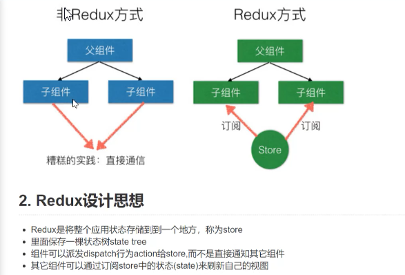
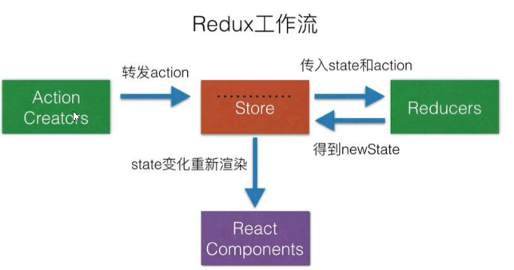
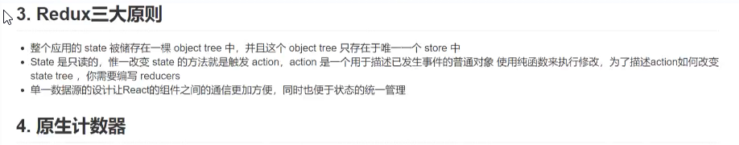

# Redux 
## Redux 示意图1

## Redux 示意图12

## Redux 示意图2


## redux 基本使用实例代码（基本计数器）
```
  import {createStore} from 'redux';
  let initState = 0;
  const INCREMENT = 'INCREMENT';
  const DECREMENT = 'DECREMENT';
  /**
   * 在redux中动作是有规定，规定必须有一个不为undefined type属性，用来表示动作类型
   * @param {*} state 
   * @param {*} action 
   */
  function reducer(state=initState,action){
     switch(action.type){
         case INCREMENT:
           return state + 1;//返回一个加1的新状态
         case DECREMENT:
           return state -1;
         default:
           return state;    
     }
  }
  let store = createStore(reducer);

  let counterValue = document.getElementById('counter-value');
  let incrementBtn = document.getElementById('increment-btn');
  let decrementBtn = document.getElementById('decrement-btn');

  function render(){
      counterValue.innerHTML =store.getState();
  }
  render();
  <!-- 订阅store从而一旦变化触发render执行 -->
  let unsubscribe = store.subscribe(render);
  setTimeout(()=>{
    unsubscribe();
  },3000);
  incrementBtn.addEventListener('click',function(){
      store.dispatch({type:INCREMENT});
  })
  decrementBtn.addEventListener('click',function(){
      store.dispatch({type:DECREMENT});
  })
```
## createStore的自我实现代码
-  isPlainObject 函数创建
```
  export default function isPlainObject(obj){
     if(typeof obj != 'object' || obj === null){
       return false;
     }
     return Object.getPrototypeOf(obj) === Object.prototype;
   /*   let xx = obj;
     while(Object.getPrototypeOf(xx)){//proto.__proto__.__proto__.__proto__ Object.prototype
      xx = Object.getPrototypeOf(xx);
     }
     return Object.getPrototypeOf(obj)  === xx; */
  }
```
-  ActionTypes函数的实现
```
  const ActionTypes = {
      INIT:`@@redux/INIT`
  }
  export default ActionTypes;
```
-   createStore创建
```
  import isPlainObject from "./utils/isPlainObject";
  import ActionTypes from "./utils/actionTypes";

  export default function createStore(reducer,preloadedState){
      if(typeof reducer != 'function'){
          throw new Error('reducer必须是一个函数');
      }
      let currentReducer = reducer;//当前的处理器
      let currentState = preloadedState;//当前状态
      let currentListeners = [];//定义一数组保存当前的监听函数
      function getState(){//返回当前状态
          return currentState;
      }
      
      function dispatch(action){//{type:'xx'}
          if(!isPlainObject(action)){
              throw new Error('action必须是一个纯对象');
          }
          if(typeof action.type =='undefined'){
              throw new Error('action的type属性不能是 undefined');
          }
          currentState = currentReducer(currentState,action);
          for(let i=0;i<currentListeners.length;i++){
              const listener = currentListeners[i];
              listener();
          }
          return action;
      }
      <!-- 订阅的返回值就是取消，如果不缓存返回值，就只有执行订阅步骤 -->
      function subscribe(listener){
          <!-- 执行订阅开始，赋值订阅标识符为true -->
          let subscribed = true;
          <!-- 将需要执行的方法，放入监听数组中 -->
          currentListeners.push(listener);
          <!-- 返回取消函数 -->
          return function unsubscribe(){
               <!-- 判断是否已取消，及订阅标识符是否为false，如false直接return -->
              if(!subscribed) return ;
              <!-- 删除需要取消的监听函数 -->
              const index = currentListeners.indexOf(listener);    
              currentListeners.splice(index,1);
              <!-- 订阅标识符赋值false -->
              subscribed = false;
          }
      }
      <!-- 初始化action值 -->
      dispatch({type:ActionTypes.INIT});
      return {
          getState,
          dispatch,
          subscribe
          
      }
  }
```