# React16源码解析(一)- 图解Fiber架构
<!-- 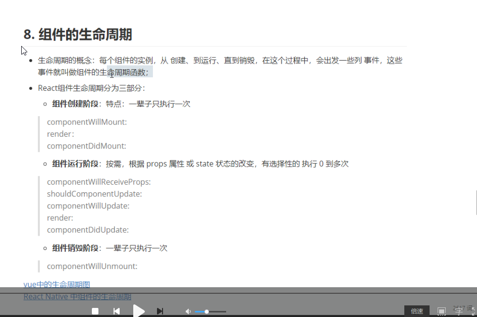 -->
React源码解析系列文章欢迎阅读：  
[React16源码解析(一)- 图解Fiber架构](https://segmentfault.com/a/1190000020736966)  
[React16源码解析(二)-创建更新](https://segmentfault.com/a/1190000020736982)  
[React16源码解析(三)-ExpirationTime](https://segmentfault.com/a/1190000020736992)  
[React16源码解析(四)-Scheduler](https://segmentfault.com/a/1190000020737020)  
[React16源码解析(五)-更新流程渲染阶段1](https://segmentfault.com/a/1190000020737050)  
[React16源码解析(六)-更新流程渲染阶段2](https://segmentfault.com/a/1190000020737054)  
[React16源码解析(七)-更新流程渲染阶段3](https://segmentfault.com/a/1190000020737059)  
[React16源码解析(八)-更新流程提交阶段](https://segmentfault.com/a/1190000020737069)  
正在更新中...

老的react架构从setState到render完成，整个过程是主要霸占主线程的。如果组件比较大，或者有些复杂的逻辑，长时间占用主线程，会导致一些input框输入操作、动画等得不到响应，从而表现出页面卡顿。

为了解决上述的问题，React引入了一个全新的异步渲染架构：Fiber。

## 概述

这是React 核心算法的一次大的更新，重写了 React 的 reconciliation 算法。reconciliation 算法是用来更新并且渲染DOM树的算法。以前React 15.x的版本使用的算法称为“stack reconciliation”，现在称为“fiber reconciler”。

fiber reconciler主要的特点是可以把更新流程拆分成一个一个的小的单元进行更新，并且可以中断，转而去执行高优先级的任务或者浏览器的动画渲染等，等主线程空闲了再继续执行更新。

另外的新功能：  
1、render方法可以返回多元素（即可以返回数组）  
2、支持异常边界处理异常；

## Fiber Tree

为了达到上述的效果，react将底层更新单元的数据结构改成了链表结构。以前的协调算法是递归调用，通过react dom 树级关系构成的栈递归。而fiber是扁平化的链表的数据存储结构，通过child找子节点，return找父节点，sibling找兄弟节点。遍历从递归改为循环。

具体的结构参照我下面画的图：  
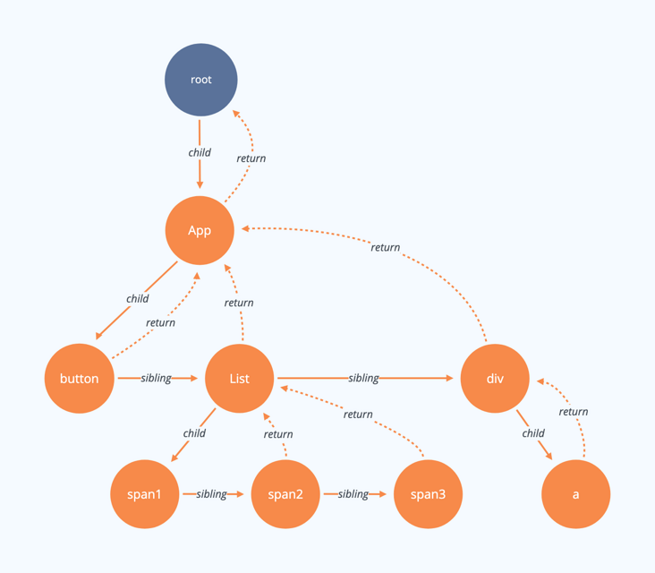

创建上面的fiber树对应的代码：

```
import React from 'react';
import ReactDOM from 'react-dom'

class List extends React.Component {
  render () {
    return (
      [1,2,3].map((item)=>{
        return <span>span</span>
      })
    )
  }
}

class App extends React.Component {
    render () {
      return (
        [<button>按钮</button>,<List/>,<div>div</div>]
      );
    }
}
ReactDOM.render(
 <App />,
 document.getElementById("root")
)
```

## 构建Fiber Tree

第一次渲染的时候会构建好这颗fiber树。以下是构建这颗fiber树的过程。  
创建过程和更新过程其实是一个过程，可以说创建过程是更新过程的一个子集，相当于每个节点的更新都是新建一个fiber节点。  
其中粉色节点代表更新完成的节点，当所有的节点都变成粉色说明整棵fiber树都已经准备好了。可以提交到真实dom树上去了。

### 1

创建一个RootFiber节点

创建RootFiber节点过程的详细源码解析欢迎阅读：  
[React16源码解析(二)-创建更新](https://segmentfault.com/a/1190000020736982)
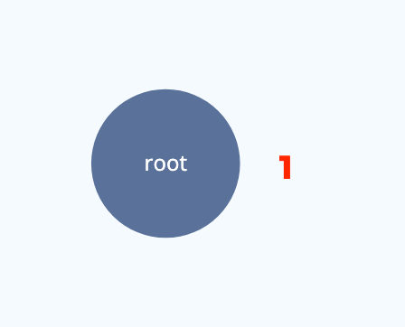
### 2

构建/更新fiber树过程详细源码解析欢迎阅读：  
[React16源码解析(五)-更新流程渲染阶段1](https://segmentfault.com/a/1190000020737050)  
[React16源码解析(六)-更新流程渲染阶段2](https://segmentfault.com/a/1190000020737054)  
[React16源码解析(七)-更新流程渲染阶段3](https://segmentfault.com/a/1190000020737059)

沿着子节点不断的创建fiber子节点，如果发现子节点是一个数组，会把子节点都创建好，之后拿到第一个子节点再往下走。  
这里图中第一个子节点button它已经没有子节点了，这个时候就会把这个节点是否有更新计算出来，算好更新之后就往回走了。我就称这个节点构建完成了。  
注：橘色节点只是创建好了fiber还没有完成。
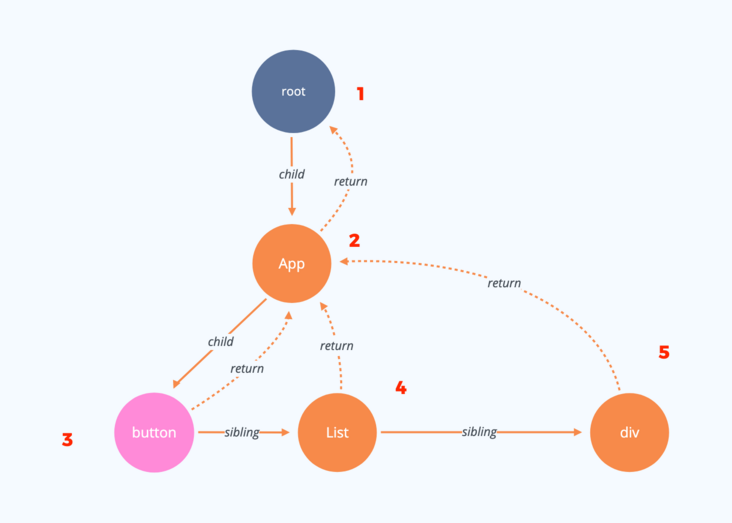

### 3

因为3号节点(button)没有子节点了，所以我们向它的兄弟节点出发了。到达4号节点，又会以同样的方式遍历子节点。
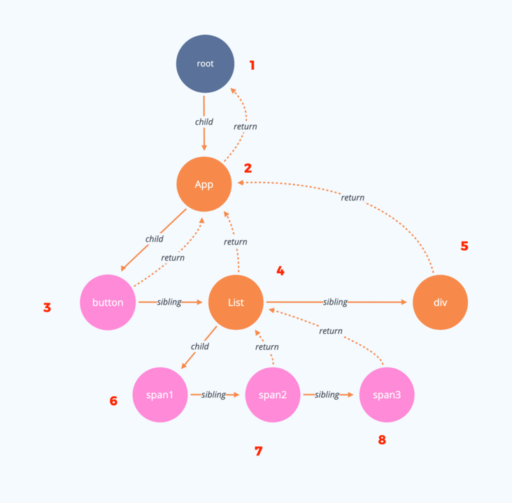


### 4

当4号节点的子节点都完成之后，回到4号节点，再完成4号节点，因为4号节点存在兄弟节点，所以再向兄弟节点出发。
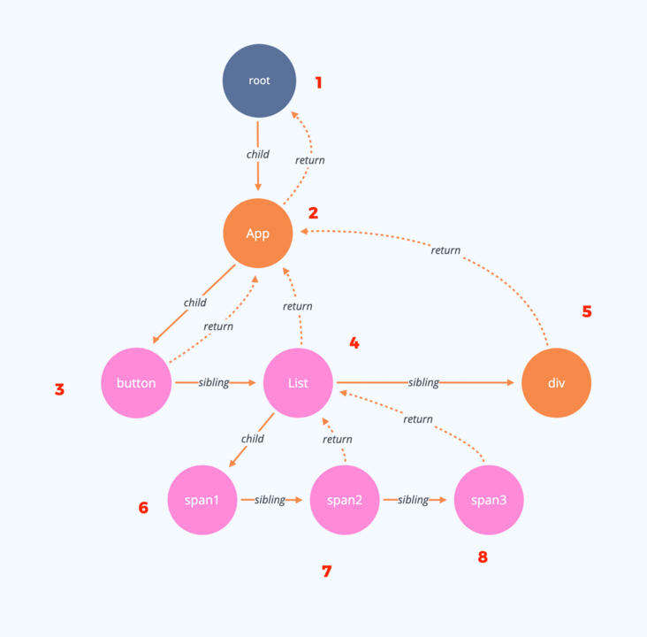

### 5

到达5号节点之后，5号节点再以同样的方式遍历子节点。
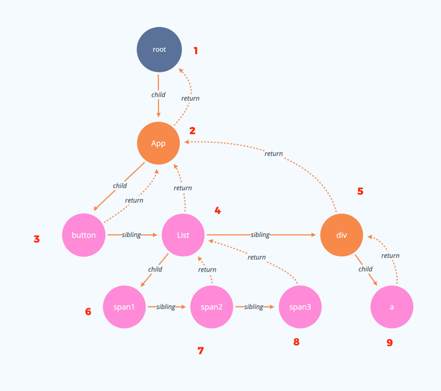


### 6

9号节点完成之后，就会一层层返回到root节点。因为返回的路上已经没有兄弟节点了。直到root节点完成，这颗fiber树就已经渲染好了，接下来就可以提交渲染树到真实的dom树了。
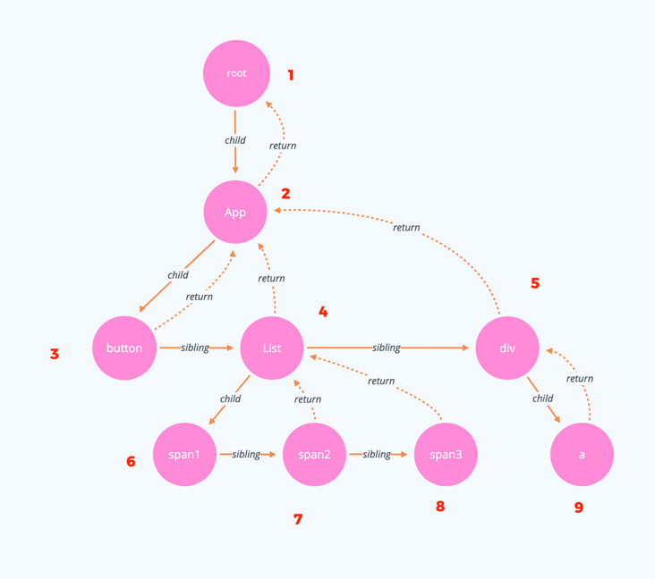

## 更新Fiber Tree

假设我现在想要更新7号节点。  
如下代码：

```
import React from 'react';
import ReactDOM from 'react-dom'

class List extends React.Component {
  render () {
    const { list } = this.props;
    return (
      list.map((item)=>{
        return <span>{item}</span>
      })
    )
  }
}

class App extends React.Component {
    constructor() {
      super();
      this.state = {
        list:[1,2,3]
      }
    }
    clickButton = () => {
      this.setState({
        list:[1,4,3]
      })
    }
    render () {
      return (
        [<button onClick={this.clickButton}>按钮</button>,<List list={this.state.list}/>,<div>div</div>]
      );
    }
}
ReactDOM.render(
 <App />,
 document.getElementById("root")
)
```

点击按钮就会更新7号节点的内容，将 2 -> 4。

### 1

当遍历到7号节点时候，发现7号节点是需要更新的，因为它身上有个叫effectTag的标志，值为4表示的是要更新本节点。这个节点需要更新所以把7号节点记录在父节点的firstEffect链表上。如图所示：
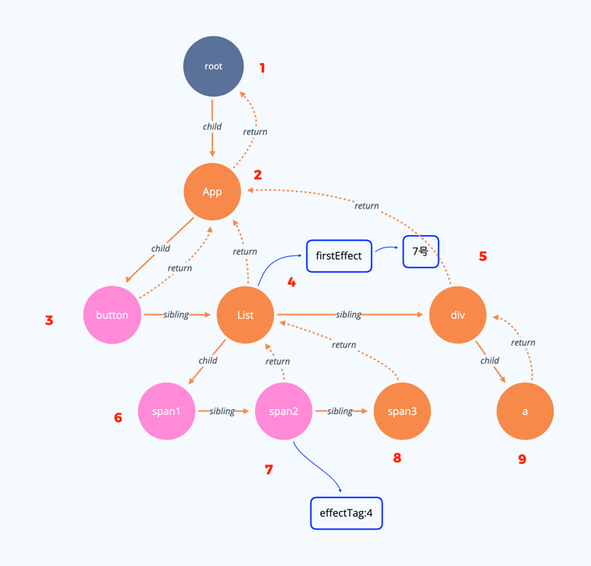

### 2

当遍历到4号节点的时候，因为它身上firstEffect不为空，所以它会把他身上的firstEffect接到父节点的身上。如图所示：
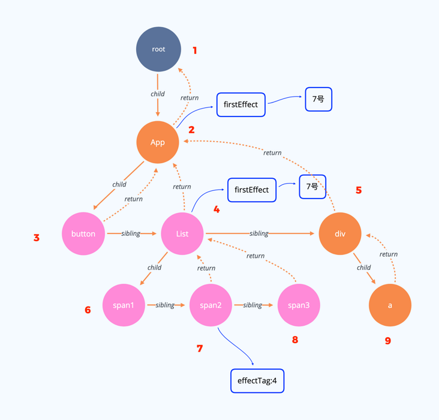

### 3

遍历到2号节点时，同样的道理：
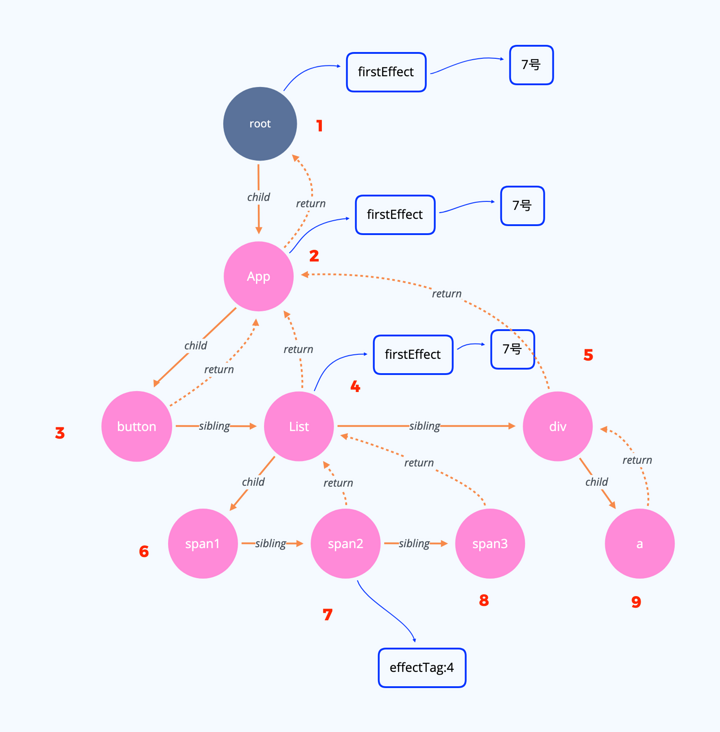

其实这里firstEffect链表后面链接的7号是一直指向7号节点的指针。在提交阶段(提交到dom树上)直接遍历root节点上的firstEffect链表就可以了。因为这上面记录了那些节点有更新，只需要更新我们标记好的节点就可以啦。

## 可中断

经过上述过程，可能大家会产生疑问，说好的可中断呢？怎么一个字也没提呢？？？  
别急，我现在一句话就能讲清了：  
上面我的图中，我的每一个步骤（实际情况步骤更多，我没画那么细）是可以不连续占用主线程的。

react把更新这颗fiber树切分成了好多个任务，每完成一小块任务，就会看看现在主线程是否有空闲，有空闲的话就继续下一个小任务，没有空闲那就把主线程让给浏览器或者更高优先级任务。那么这颗fiber树的更新就会被停滞，得到主线程有空了，在继续渲染。

那么问题又来，我怎么知道主线程什么时候有空？什么时候没空？  
这个时候我们想起了requestIdleCallback这个原始api。但是~ react并没有用上requestIdleCallback。主要还是因为浏览器的兼容性问题。所以采用了polyfill方案。  
详细源码解析欢迎阅读：  
[React16源码解析(四)-Scheduler](https://segmentfault.com/a/1190000020737020)  
[React16源码解析(三)-ExpirationTime](https://segmentfault.com/a/1190000020736992)

注意：上面我构建的fiber树只是一个虚拟的dom结构，这个fiber树全部更新好了之后，就会一次性的提交到真实的dom树上，这个一次性的提交是不可以中断的。  
提交阶段的详细源码解析欢迎阅读：  
[React16源码解析(八)-更新流程提交阶段](https://segmentfault.com/a/1190000020737069)

文章如有不妥，欢迎指正~