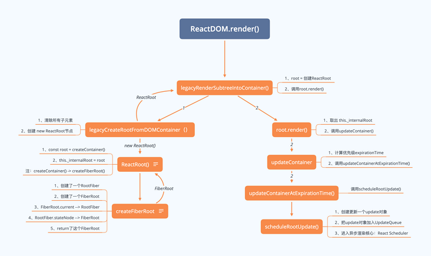
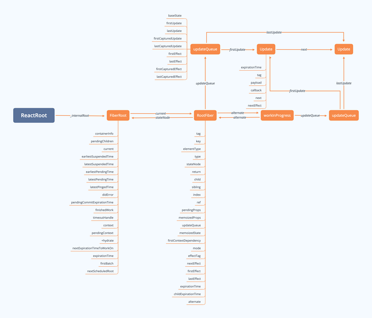

# React16源码解析(二)-创建更新
React源码解析系列文章欢迎阅读：  
[React16源码解析(一)- 图解Fiber架构](https://segmentfault.com/a/1190000020736966)  
[React16源码解析(二)-创建更新](https://segmentfault.com/a/1190000020736982)  
[React16源码解析(三)-ExpirationTime](https://segmentfault.com/a/1190000020736992)  
[React16源码解析(四)-Scheduler](https://segmentfault.com/a/1190000020737020)  
[React16源码解析(五)-更新流程渲染阶段1](https://segmentfault.com/a/1190000020737050)  
[React16源码解析(六)-更新流程渲染阶段2](https://segmentfault.com/a/1190000020737054)  
[React16源码解析(七)-更新流程渲染阶段3](https://segmentfault.com/a/1190000020737059)  
[React16源码解析(八)-更新流程提交阶段](https://segmentfault.com/a/1190000020737069)  
正在更新中...

在React中创建更新主要有下面三种方式：

1、ReactDOM.render() || hydrate  
2、setState  
3、forceUpdate

注：  
除了上面的还有react 16.8 引进的hooks 中的useState，这个我们后续再讲。  
hydrate是服务端渲染相关的，这块我并不会重点讲解。

## 一、ReactDOM.render()


调用legacyRenderSubtreeIntoContainer()

```
const ReactDOM: Object = {
  // ......
  render(
    element: React$Element<any>,//传入的React组件
    container: DOMContainer,//挂载的容器节点
    callback: ?Function,//挂载后的回调函数
  ) {
    return legacyRenderSubtreeIntoContainer(
      null,
      element,
      container,
      false,
      callback,
    );
  },
  // ......
}
```

### legacyRenderSubtreeIntoContainer

1、root = 创建ReactRoot  
2、调用root.render()

```
function legacyRenderSubtreeIntoContainer(
  parentComponent: ?React$Component<any, any>,//null
  children: ReactNodeList,//传入进来需要挂在的class component
  container: DOMContainer,//根节点
  forceHydrate: boolean,//false
  callback: ?Function,//挂载完成后的回调函数
) {
  // ......
  // 是否存在根节点   初次渲染是不存在根节点的
  let root: Root = (container._reactRootContainer: any);
  if (!root) {
    // 1、创建ReactRoot 赋值给container._reactRootContainer和root（这里发生了很多事，一件很重要很重要的事   生成了fiber结构树。。）
    root = container._reactRootContainer = legacyCreateRootFromDOMContainer(
      container,
      forceHydrate,
    );
    // ......
  } else {
    // ......
    // 2、调用root.render()
    root.render(children, callback);
  }
  return DOMRenderer.getPublicRootInstance(root._internalRoot);
}
```

### legacyCreateRootFromDOMContainer

1、清除所有子元素  
2、创建 new ReactRoot节点

```
function legacyCreateRootFromDOMContainer(
  container: DOMContainer,//根节点
  forceHydrate: boolean,//false
): Root {
  //  服务端渲染相关 是否合并原先存在的dom节点 一般是false
  const shouldHydrate =
    forceHydrate || shouldHydrateDueToLegacyHeuristic(container);
  // 1、清除所有子元素，通过container.lastchild循环来清除container的所有内容，因为我们的属于首次渲染，container里边不包含任何元素
  if (!shouldHydrate) {
    let warned = false;
    let rootSibling;
    while ((rootSibling = container.lastChild)) {
      // ......
      container.removeChild(rootSibling);
    }
  }
  // Legacy roots are not async by default.
  const isConcurrent = false;
  // 2、创建 new ReactRoot节点
  return new ReactRoot(container, isConcurrent, shouldHydrate);
}
```

### ReactRoot

从ReactRoot中， 我们把createContainer返回值赋给了 实例的\_internalRoot， 往下看createContainer

```
function ReactRoot(
  container: Container,
  isConcurrent: boolean,
  hydrate: boolean,
) {
  // 这里创建了一个FiberRoot
  const root = DOMRenderer.createContainer(container, isConcurrent, hydrate);
  this._internalRoot = root;
}
```

### createContainer

从createContainer看出， createContainer实际上是直接返回了createFiberRoot, 而createFiberRoot则是通过createHostRootFiber函数的返回值uninitializedFiber，并将其赋值在root对象的current上， 这里需要注意一个点就是，uninitializedFiber的stateNode的值是root， 即他们互相引用。

创建一个RootFiber -> createHostRootFiber() -> createFiber() -> new FiberNode()

这里创建的这个RootFiber里面的绝大部分属性都是初始值null或者是NoWork。所以具体代码我就没有贴出来了。  
这里我提下有意义的点：  
RootFiber上的tag会被赋值为 HostRoot。这个之后会用来判断节点类型。

还有这里创建的FiberRoot还有一个containerInfo置为ReactDOM.render第二个参数传入进来的容器节点。这个后续挂载的时候会用到。

```
export function createContainer(
  containerInfo: Container,
  isConcurrent: boolean,
  hydrate: boolean,
): OpaqueRoot {
  return createFiberRoot(containerInfo, isConcurrent, hydrate);
}

export function createFiberRoot(
  containerInfo: any,
  isConcurrent: boolean,
  hydrate: boolean,
): FiberRoot {
  // 1、创建了一个RootFiber
  const uninitializedFiber = createHostRootFiber(isConcurrent);
  // 2、互相引用
  // RootFiber.stateNode --> FiberRoot
  // FiberRoot.current --> RootFiber
  let root;
  root = {
    current: uninitializedFiber,
    containerInfo: containerInfo,
    // ......
  }
  uninitializedFiber.stateNode = root;
  // 3、return了这个FiberRoot
  return ((root: any): FiberRoot);
}
```

### FiberRoot

这里牵扯到两种react中的数据结构，第一个FiberRoot，也就是上面createFiberRoot函数返回的对象。

```
type BaseFiberRootProperties = {|
  // root节点，render方法接收的第二个参数
  containerInfo: any,
  // 只有在持久更新中会用到，也就是不支持增量更新的平台，react-dom不会用到
  pendingChildren: any,
  // 当前应用对应的Fiber对象，是Root Fiber
  current: Fiber,

  // 一下的优先级是用来区分
  // 1) 没有提交(committed)的任务
  // 2) 没有提交的挂起任务
  // 3) 没有提交的可能被挂起的任务
  // 我们选择不追踪每个单独的阻塞登记，为了兼顾性能
  // The earliest and latest priority levels that are suspended from committing.
  // 最老和新的在提交的时候被挂起的任务
  earliestSuspendedTime: ExpirationTime,
  latestSuspendedTime: ExpirationTime,
  // The earliest and latest priority levels that are not known to be suspended.
  // 最老和最新的不确定是否会挂起的优先级（所有任务进来一开始都是这个状态）
  earliestPendingTime: ExpirationTime,
  latestPendingTime: ExpirationTime,
  // The latest priority level that was pinged by a resolved promise and can
  // be retried.
  // 最新的通过一个promise被reslove并且可以重新尝试的优先级
  latestPingedTime: ExpirationTime,

  // 如果有错误被抛出并且没有更多的更新存在，我们尝试在处理错误前同步重新从头渲染
  // 在`renderRoot`出现无法处理的错误时会被设置为`true`
  didError: boolean,

  // 正在等待提交的任务的`expirationTime`
  pendingCommitExpirationTime: ExpirationTime,
  // 已经完成的任务的FiberRoot对象，如果你只有一个Root，那他永远只可能是这个Root对应的Fiber，或者是null
  // 在commit阶段只会处理这个值对应的任务
  finishedWork: Fiber | null,
  // 在任务被挂起的时候通过setTimeout设置的返回内容，用来下一次如果有新的任务挂起时清理还没触发的timeout
  timeoutHandle: TimeoutHandle | NoTimeout,
  // 顶层context对象，只有主动调用`renderSubtreeIntoContainer`时才会有用
  context: Object | null,
  pendingContext: Object | null,
  // 用来确定第一次渲染的时候是否需要融合
  +hydrate: boolean,
  // 当前root上剩余的过期时间
  // TODO: 提到renderer里面区处理
  nextExpirationTimeToWorkOn: ExpirationTime,
  // 当前更新对应的过期时间
  expirationTime: ExpirationTime,
  // List of top-level batches. This list indicates whether a commit should be
  // deferred. Also contains completion callbacks.
  // TODO: Lift this into the renderer
  // 顶层批次（批处理任务？）这个变量指明一个commit是否应该被推迟
  // 同时包括完成之后的回调
  // 貌似用在测试的时候？
  firstBatch: Batch | null,
  // root之间关联的链表结构
  nextScheduledRoot: FiberRoot | null,
|};
```

### Fiber

这里就是createHostRootFiber函数返回的fiber对象。注意这里其实每一个节点都对应一个fiber对象，不是Root专有的哦。

```
// Fiber对应一个组件需要被处理或者已经处理了，一个组件可以有一个或者多个Fiber
type Fiber = {|
  // 标记不同的组件类型
  // export const FunctionComponent = 0;
  // export const ClassComponent = 1;
  // export const IndeterminateComponent = 2; // Before we know whether it is function or class
  // export const HostRoot = 3; // Root of a host tree. Could be nested inside another node.
  // export const HostPortal = 4; // A subtree. Could be an entry point to a different renderer.
  // export const HostComponent = 5;
  // export const HostText = 6;
  // export const Fragment = 7;
  // export const Mode = 8;
  // export const ContextConsumer = 9;
  // export const ContextProvider = 10;
  // export const ForwardRef = 11;
  // export const Profiler = 12;
  // export const SuspenseComponent = 13;
  // export const MemoComponent = 14;
  // export const SimpleMemoComponent = 15;
  // export const LazyComponent = 16;
  // export const IncompleteClassComponent = 17;
  tag: WorkTag,

  // ReactElement里面的key
  key: null | string,

  // ReactElement.type，标签类型，也就是我们调用`createElement`的第一个参数
  elementType: any,

  // The resolved function/class/ associated with this fiber.
  // 异步组件resolved之后返回的内容，一般是`function`或者`class`
  type: any,

  // The local state associated with this fiber.
  // 跟当前Fiber相关本地状态（比如浏览器环境就是DOM节点）
  stateNode: any,

  // 指向他在Fiber节点树中的`parent`，用来在处理完这个节点之后向上返回
  return: Fiber | null,

  // 单链表树结构
  // 指向自己的第一个子节点
  child: Fiber | null,
  // 指向自己的兄弟结构
  // 兄弟节点的return指向同一个父节点
  sibling: Fiber | null,
  index: number,

  // ref属性
  ref: null | (((handle: mixed) => void) & {_stringRef: ?string}) | RefObject,

  // 新的变动带来的新的props
  pendingProps: any, 
  // 上一次渲染完成之后的props
  memoizedProps: any,

  // 该Fiber对应的组件产生的Update会存放在这个队列里面
  updateQueue: UpdateQueue<any> | null,

  // 上一次渲染的时候的state
  memoizedState: any,

  // 一个列表，存放这个Fiber依赖的context
  firstContextDependency: ContextDependency<mixed> | null,

  // 用来描述当前Fiber和他子树的`Bitfield`
  // 共存的模式表示这个子树是否默认是异步渲染的
  // Fiber被创建的时候他会继承父Fiber
  // 其他的标识也可以在创建的时候被设置
  // 但是在创建之后不应该再被修改，特别是他的子Fiber创建之前
  mode: TypeOfMode,

  // Effect
  // 用来记录Side Effect
  // Don't change these two values. They're used by React Dev Tools.
  // export const NoEffect = /*              */ 0b00000000000;
  // export const PerformedWork = /*         */ 0b00000000001;

  // You can change the rest (and add more).
  // export const Placement = /*             */ 0b00000000010;
  // export const Update = /*                */ 0b00000000100;
  // export const PlacementAndUpdate = /*    */ 0b00000000110;
  // export const Deletion = /*              */ 0b00000001000;
  // export const ContentReset = /*          */ 0b00000010000;
  // export const Callback = /*              */ 0b00000100000;
  // export const DidCapture = /*            */ 0b00001000000;
  // export const Ref = /*                   */ 0b00010000000;
  // export const Snapshot = /*              */ 0b00100000000;

  // Update & Callback & Ref & Snapshot
  // export const LifecycleEffectMask = /*   */ 0b00110100100;

  // Union of all host effects
  // export const HostEffectMask = /*        */ 0b00111111111;

  // export const Incomplete = /*            */ 0b01000000000;
  // export const ShouldCapture = /*         */ 0b10000000000;
  effectTag: SideEffectTag,

  // 单链表用来快速查找下一个side effect
  nextEffect: Fiber | null,

  // 子树中第一个side effect
  firstEffect: Fiber | null,
  // 子树中最后一个side effect
  lastEffect: Fiber | null,

  // 代表任务在未来的哪个时间点应该被完成
  // 不包括他的子树产生的任务
  expirationTime: ExpirationTime,

  // 快速确定子树中是否有不在等待的变化
  childExpirationTime: ExpirationTime,

  // 在Fiber树更新的过程中，每个Fiber都会有一个跟其对应的Fiber
  // 我们称他为`current <==> workInProgress`
  // 在渲染完成之后他们会交换位置
  alternate: Fiber | null,

  // 下面是调试相关的，收集每个Fiber和子树渲染时间的

  actualDuration?: number,

  // If the Fiber is currently active in the "render" phase,
  // This marks the time at which the work began.
  // This field is only set when the enableProfilerTimer flag is enabled.
  actualStartTime?: number,

  // Duration of the most recent render time for this Fiber.
  // This value is not updated when we bailout for memoization purposes.
  // This field is only set when the enableProfilerTimer flag is enabled.
  selfBaseDuration?: number,

  // Sum of base times for all descedents of this Fiber.
  // This value bubbles up during the "complete" phase.
  // This field is only set when the enableProfilerTimer flag is enabled.
  treeBaseDuration?: number,

  // Conceptual aliases
  // workInProgress : Fiber ->  alternate The alternate used for reuse happens
  // to be the same as work in progress.
  // __DEV__ only
  _debugID?: number,
  _debugSource?: Source | null,
  _debugOwner?: Fiber | null,
  _debugIsCurrentlyTiming?: boolean,
|};
```

### root.render()

经过上面的步骤，创建好了ReactRoot。初始化完成了。下面开始root.render。  
我们回到legacyRenderSubtreeIntoContainer函数，前面一堆讲解的是调用legacyCreateRootFromDOMContainer方法我们得到了一个ReactRoot对象。reactRoot的原型上面我们找到了render方法：

```
ReactRoot.prototype.render = function(
  children: ReactNodeList,
  callback: ?() => mixed,
): Work {
  // 这个就是我们上面创建的FiberRoot对象
  const root = this._internalRoot;
  // ......
  DOMRenderer.updateContainer(children, root, null, work._onCommit);
  return work;
};
```

### updateContainer

这个函数里面使用了 currentTime 和 expirationTime, currentTime是用来计算expirationTime的,expirationTime代表着优先级， 这个留在后续分析。后续紧接着调用了updateContainerAtExpirationTime。

```
export function updateContainer(
  element: ReactNodeList,
  container: OpaqueRoot,
  parentComponent: ?React$Component<any, any>,
  callback: ?Function,
): ExpirationTime {
  // 这个current就是FiberRoot对应的RootFiber
  const current = container.current;
  const currentTime = requestCurrentTime();
  const expirationTime = computeExpirationForFiber(currentTime, current);
  return updateContainerAtExpirationTime(
    element,
    container,
    parentComponent,
    expirationTime,
    callback,
  );
}
```

注：这个函数在ReactFiberReconciler.js里面。

### updateContainerAtExpirationTime

这里将current（即Fiber实例）提取出来， 并作为参数传入调用scheduleRootUpdate

```
export function updateContainerAtExpirationTime(
  element: ReactNodeList,
  container: OpaqueRoot,
  parentComponent: ?React$Component<any, any>,
  expirationTime: ExpirationTime,
  callback: ?Function,
) {
  const current = container.current;
  
  return scheduleRootUpdate(current, element, expirationTime, callback);
}
```

### scheduleRootUpdate

这个函数主要执行了两个操作：  
1、创建更新createUpdate并放到更新队列enqueueUpdate，创建更新的具体细节稍后再讲哈。因为待会我们会发现其他地方也用到了。  
2、个是执行sheculeWork函数，进入React异步渲染的核心：React Scheduler，这个我后续文章详细讲解。

```
function scheduleRootUpdate(
  current: Fiber,
  element: ReactNodeList,
  expirationTime: ExpirationTime,
  callback: ?Function,
) {
  // ......
  // 1、创建一个update对象
  const update = createUpdate(expirationTime);
  update.payload = {element};

  // ......
  // 2、将刚创建的update对象入队到fiber.updateQueue队列中
  enqueueUpdate(current, update);

  // 3、开始进入React异步渲染的核心：React Scheduler
  scheduleWork(current, expirationTime);
  return expirationTime;
}
```

### 图解

以上的过程我画了张图： 



## 二、setState

虽然我还没有讲解到class component 的渲染过程，但是这个不影响我现在要讨论的内容~  
如下我们调用this.setState方法的时候，调用了this.updater.enqueueSetState

```
Component.prototype.setState = function(partialState, callback) {
  this.updater.enqueueSetState(this, partialState, callback, 'setState');
};
```

先不管this.updater什么时候被赋值的，直接看到ReactFiberClassComponent.js中的enqueueSetState，这就是我们调用setState执行的enqueueSetState方法。

```
const classComponentUpdater = {
  // ......
  enqueueSetState(inst, payload, callback) {
    // inst 就是我们调用this.setState的this，也就是classComponent实例
    // 获取到当前实例上的fiber
    const fiber = ReactInstanceMap.get(inst);
    const currentTime = requestCurrentTime();
    // 计算当前fiber的到期时间（优先级）
    const expirationTime = computeExpirationForFiber(currentTime, fiber);

    // 创建更新一个更新update
    const update = createUpdate(expirationTime);

    //payload是setState传进来的要更新的对象
    update.payload = payload;

    //callback就是setState({},()=>{})的回调函数
    if (callback !== undefined && callback !== null) {
      if (__DEV__) {
        warnOnInvalidCallback(callback, 'setState');
      }
      update.callback = callback;
    }

    // 把更新放到队列UpdateQueue
    enqueueUpdate(fiber, update);

    // 开始进入React异步渲染的核心：React Scheduler
    scheduleWork(fiber, expirationTime);
  },
  // ......
}
```

看到上面的代码，是不是发现和上面ReactDOM.render中scheduleRootUpdate非常的相似。其实他们就是同一个更新原理呢~

## 三、forceUpdate

废话不多说，先上代码。也是在ReactFiberClassComponent.js中classComponentUpdater对象中。

```
const classComponentUpdater = {
  // ......
  enqueueForceUpdate(inst, callback) {
    const fiber = ReactInstanceMap.get(inst);
    const currentTime = requestCurrentTime();
    const expirationTime = computeExpirationForFiber(currentTime, fiber);

    const update = createUpdate(expirationTime);

    //与setState不同的地方
    //默认是0更新，需要改成2强制更新
    update.tag = ForceUpdate;

    if (callback !== undefined && callback !== null) {
      if (__DEV__) {
        warnOnInvalidCallback(callback, 'forceUpdate');
      }
      update.callback = callback;
    }

    enqueueUpdate(fiber, update);
    scheduleWork(fiber, expirationTime);
  },
  // ......
}
```

看到代码的我们很开心，简直就是enqueueSetState的孪生兄弟。我就不详说啦。

到这里我们总结一下上面三种更新的流程：  
（1）获取节点对应的fiber对象  
（2）计算currentTime  
（3）根据（1）fiber和（2）currentTime计算fiber对象的expirationTime  
（4）根据（3）expirationTime创建update对象  
（5）将setState中要更新的对象赋值到（4）update.payload，ReactDOM.render是{element}  
（6）将callback赋值到（4）update.callback  
（7）update入队updateQueue  
（8）进行任务调度

## 四、update对象

上面三种创建更新的方式中都创建了一个叫update的对象。那这个对象里面到底是什么呢？充满好奇的我们点开createUpdate函数瞧瞧：

```
export function createUpdate(expirationTime: ExpirationTime): Update<*> {
  return {
    // 过期时间
    expirationTime: expirationTime,

    // export const UpdateState = 0;
    // export const ReplaceState = 1;
    // export const ForceUpdate = 2;
    // export const CaptureUpdate = 3;
    // 指定更新的类型，值为以上几种
    // 提下CaptureUpdate，在React16后有一个ErrorBoundaries功能
    // 即在渲染过程中报错了，可以选择新的渲染状态（提示有错误的状态），来更新页面
    // 0更新 1替换 2强制更新 3捕获性的更新
    tag: UpdateState,

    // 更新内容，比如`setState`接收的第一个参数
    // 第一次渲染ReactDOM.render接收的是payload = {element};
    payload: null,

    // 更新完成后对应的回调，`setState`，`render`都有
    callback: null,

    // 指向下一个更新
    next: null,

    // 指向下一个`side effect`，这块内容后续讲解
    nextEffect: null,
  };
}
```

就是返回了个简单的对象。对象每个属性的解释我都写在上面了。

## 五、UpdateQueue

UpdateQueue是一个单向链表，用来存放update。每个update用next连接。它的结构如下：

```

//创建更新队列
export function createUpdateQueue<State>(baseState: State): UpdateQueue<State> {
  const queue: UpdateQueue<State> = {
    // 应用更新后的state
    // 每次的更新都是在这个baseState基础上进行更新
    baseState,
    // 队列中的第一个update
    firstUpdate: null,
    // 队列中的最后一个update
    lastUpdate: null,
    // 队列中第一个捕获类型的update
    firstCapturedUpdate: null,
    // 队列中最后一个捕获类型的update
    lastCapturedUpdate: null,
    // 第一个side effect
    firstEffect: null,
    // 最后一个side effect
    lastEffect: null,
    // 第一个和最后一个捕获产生的`side effect`
    firstCapturedEffect: null,
    lastCapturedEffect: null,
  };
  return queue;
}
```

## 六、enqueueUpdate

创建了update对象之后，紧接着调用了enqueueUpdate，把update对象放到队列enqueueUpdate。同时保证current和workInProgress的updateQueue是一致的，即fiber.updateQueue和fiber.alternate.updateQueue保持一致。

```
export function enqueueUpdate<State>(fiber: Fiber, update: Update<State>) {
  // 保证current和workInProgress的updateQueue是一致的
  // alternate即workInProgress
  const alternate = fiber.alternate;
  // current的队列
  let queue1;
  // alternate的队列
  let queue2;
  // 如果alternate为空
  if (alternate === null) {
    // There's only one fiber.
    queue1 = fiber.updateQueue;
    queue2 = null;
    // 如果queue1仍为空，则初始化更新队列
    if (queue1 === null) {
      queue1 = fiber.updateQueue = createUpdateQueue(fiber.memoizedState);
    }
  } else {
    // 如果alternate不为空，则取各自的更新队列
    queue1 = fiber.updateQueue;
    queue2 = alternate.updateQueue;
    if (queue1 === null) {
      if (queue2 === null) {
        // 初始化
        queue1 = fiber.updateQueue = createUpdateQueue(fiber.memoizedState);
        queue2 = alternate.updateQueue = createUpdateQueue(
          alternate.memoizedState,
        );
      } else {
        // 如果queue2存在但queue1不存在的话，则根据queue2复制queue1
        queue1 = fiber.updateQueue = cloneUpdateQueue(queue2);
      }
    } else {
      if (queue2 === null) {
        // Only one fiber has an update queue. Clone to create a new one.
        queue2 = alternate.updateQueue = cloneUpdateQueue(queue1);
      } else {
        // Both owners have an update queue.
      }
    }
  }
  if (queue2 === null || queue1 === queue2) {
    // 将update放入queue1中
    appendUpdateToQueue(queue1, update);
  } else {
    // 两个队列共享的是用一个update
    // 如果两个都是空队列，则添加update
    if (queue1.lastUpdate === null || queue2.lastUpdate === null) {
      appendUpdateToQueue(queue1, update);
      appendUpdateToQueue(queue2, update);
    } else {
      // 如果两个都不是空队列，由于两个结构共享，所以只在queue1加入update
      // 在queue2中，将lastUpdate指向update
      appendUpdateToQueue(queue1, update);
      queue2.lastUpdate = update;
    }
  }
```

总结上面过程：  
（1）queue1取的是fiber.updateQueue;

```
queue2取的是alternate.updateQueue
```

（2）如果两者均为null，则调用createUpdateQueue()获取初始队列  
（3）如果两者之一为null，则调用cloneUpdateQueue()从对方中获取队列  
（4）如果两者均不为null，则将update作为lastUpdate

注：两个队列共享的是同一个update。

## 七、scheduleWork

上面三种更新最后都调用了scheduleWork(fiber, expirationTime)进入React异步渲染的核心：React Scheduler。后续文章详细讲解。

文章如有不妥，欢迎指正~