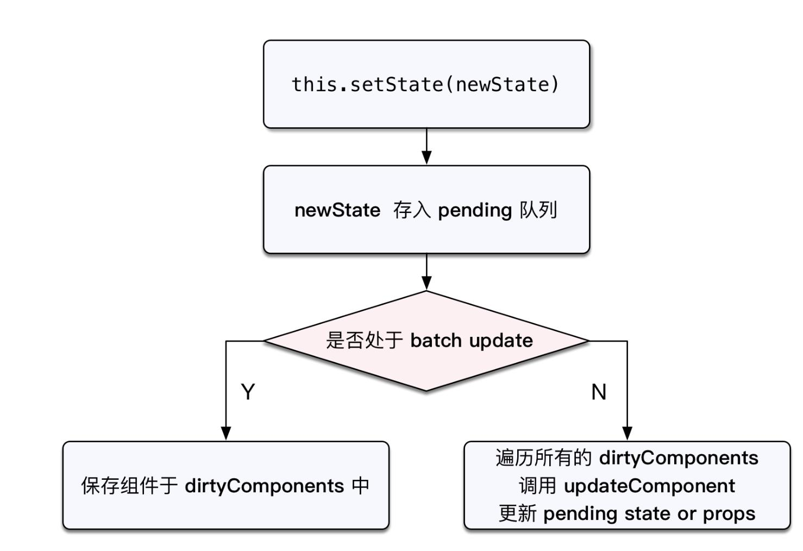
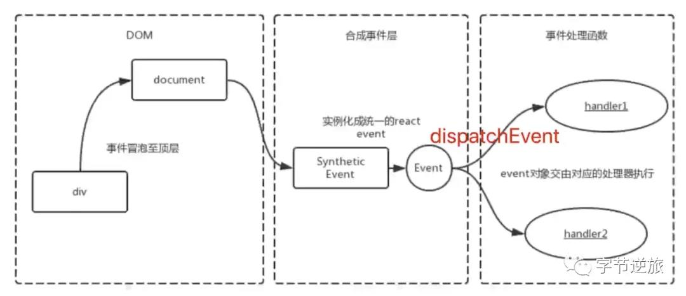

# 手写React知识点
## 以button元素为例 点击button 使得 button中的数字number增加
### 原生js版本一 不可复用
```
  <!DOCTYPE html>
  <html lang="en">
  <head>
      <meta charset="UTF-8">
      <meta name="viewport" content="width=device-width, initial-scale=1.0">
      <meta http-equiv="X-UA-Compatible" content="ie=edge">
      <title>Document</title>
  </head>
  <body>
  <button id="counter-app">0</button>
  <script src="index.js"></script>
  <script>
   let counterApp = document.getElementById('counter-app');
   let number=0;
   counterApp.addEventListener('click',()=>{
      counterApp.innerHTML = ++number;
   });
  </script>    
  </body>
  </html>
```
### 原生js版本而 使用类 可复用
```
  class Counter {
    constructor() {
      this.state = {number:0}
    }
    //定义函数将dom模板字符串生成dom
    createDOMFromDOMString(domString) {
      let div = document.createElement('div')
      div.innerHTML = domString
      return div.children[0]
    }
    //触发add函数，修改button中的number
    add() {
      //修改number，加1
      this.state = {number:this.state.number+1}
      //缓存老的dom
      let oldElement = this.doElemnt
      //缓存新生成的dom
      let newElement = this.render()
      //将新的dom换掉老的dom
      oldElement.parentElement.replaceChild(newElement,oldElement)
    }
    render() {
      this.domElemt = this.createDOMFromDOMString(
        `<button id="counter-app">{this.state.number}</button>`
      )
      this.domElement.addEventListener('click',this.add.bind(this))
      return this.domElement
    }
  }
```
###  抽象生成Component父类，更大范围的复用
```
  //react中的事件都是合成事件并非原生的，都是挂载在document上的，为此定义一个全局触发
  //事件方法，传导具体实例的方法
  window.trigger = function(event,method){
   let component = event.target.component;//event.target=this.domElement
   transaction.perform(component[method].bind(component));
  }
  class Component {
    constructor(props) {
      this.props = props
    }
     //定义函数将dom模板字符串生成dom
    createDOMFromDOMString(domString) {
      let div = document.createElement('div')
      div.innerHTML = domString
      return div.children[0]
    }
    setState(particalState) {
       this.state = Object.assign(this.state,particalState) 
      //缓存老的dom
      let oldElement = this.doElemnt
      //缓存新生成的dom
      let newElement = this.renderElement()
      //将新的dom换掉老的dom
      oldElement.parentElement.replaceChild(newElement,oldElement)
    }
    <!-- 把一个DOM字符串转换成一个真实的dom结构 -->
    renderElement() {
      <!-- 从子类中获取返回的模板字符串 -->
      this.htmlString = this.render();
      this.domElemt = this.createDOMFromDOMString(htmlString)
      //让这个BUTTONDOM节点的component属性等于当前Counter组建的实例
      this.domElement.component = this;
      <!-- this.domElement.addEventListener('click',this.add.bind(this)) -->
      return this.domElement
    }
    //创建挂载函数，直接将renderElemet的返回值 dom挂载到父节点上面去
    mount(container) {
      container.appendChild(this.renderElement())
    }

  }
  class Counter {
    constructor(props) {
      super(props)
      this.state = {number:0}
    }
    //触发add函数，修改button中的number
    add() {
      //z直接调用父类中的setState，传入需要修改的状态值 number
      this.setState({number:this.state.number+1})
    }
    render() {
      return `<button id="counter-app">{this.state.number}</button>`
    }
  }
```
## setState的原理图

## react事件机制图解1
