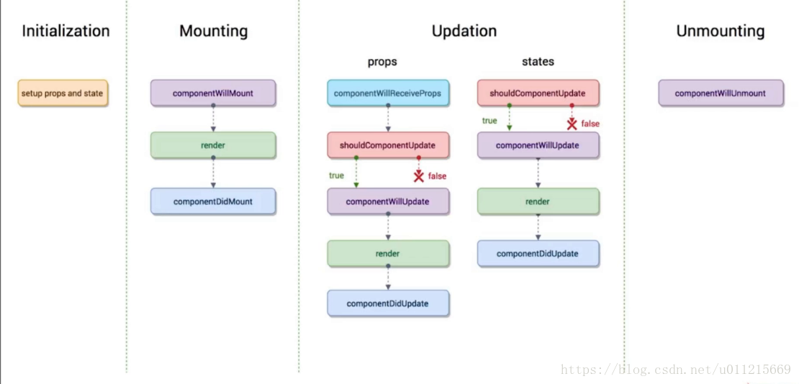
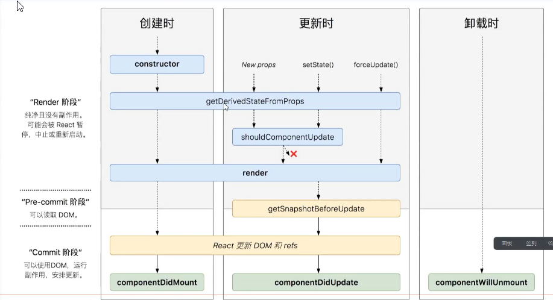

# React生命周期知识点
## 生命周期函数
<!--  -->

```
  import React, { Component } from 'react'

  export default class LifeCycle extends Component {
      //// props = {age:10,name:'计数器'}
    static defaultProps = {
        name:'计数器'
    }
    constructor(props){
        //Must call super constructor in derived class before accessing 'this' or returning from derived constructor
      super();//this.props = props;
      this.state = {number:0,users:[]};//初始化默认的状态对象
      console.log('1. constructor 初始化 props and state');
    
    }  
    //componentWillMount在渲染过程中可能会执行多次
    componentWillMount(){
      console.log('2. componentWillMount 组件将要挂载');
      //localStorage.get('userss');
    }
    //componentDidMount在渲染过程中永远只有执行一次
    //一般是在componentDidMount执行副作用，进行异步操作
    componentDidMount(){
      console.log('4. componentDidMount 组件挂载完成');
      fetch('https://api.github.com/users').then(res=>res.json()).then(users=>{
          console.log(users);
          this.setState({users});
      });
    }
    shouldComponentUpdate(nextProps,nextState){
      console.log('Counter',nextProps,nextState);
      console.log('5. shouldComponentUpdate 询问组件是否需要更新');
      return true;
    }
    componentWillUpdate(){
      console.log('6. componentWillUpdate 组件将要更新');
    }
    componentDidUpdate(){
      console.log('7. componentDidUpdate 组件更新完毕');
    }
    add = ()=>{
        this.setState({number:this.state.number});
    }
    render() {
      console.log('3.render渲染，也就是挂载')
      return (
        <div style={{border:'5px solid red',padding:'5px'}}>
          <p>{this.props.name}:{this.state.number}</p>
          <button onClick={this.add}>+</button>
          <ul>
              {
                  this.state.users.map(user=>(<li>{user.login}</li>))
              }
          </ul>
          {this.state.number%2==0&&<SubCounter number={this.state.number}/>}
        </div>
      )
    }
  }
  class SubCounter extends Component{
      constructor(props){
          super(props);
          this.state = {number:0};
      }
      componentWillUnmount(){
          console.log('SubCounter componentWillUnmount');
      }
      //调用此方法的时候会把新的属性对象和新的状态对象传过来
      shouldComponentUpdate(nextProps,nextState){
          console.log('SubCounter',nextProps,nextState);
          if(nextProps.number%3==0){
              return true;
          }else{
              return false;
          }
      }
      //componentWillReceiveProp 组件收到新的属性对象
      componentWillReceiveProps(){
        console.log('SubCounter 1.componentWillReceiveProps')
      }
      render(){
          console.log('SubCounter  2.render')
          return(
              <div style={{border:'5px solid green'}}>
                  <p>{this.props.number}</p>
              </div>
          )
      }
  }
```
## react生命周期原理图

## react最新生命周期原理图

### 新的生命周期函数getDrivedStateFromProps
```
  import React, { Component } from 'react'
  export default class Counter extends Component {
      constructor() {
          super();
          this.state = {number:0};
      }
      add = ()=>{
          this.setState({number:this.state.number+1});
      }
      render() {
          return (
              <div>
                  <p>{this.state.number}</p>
                  <button onClick={this.add}>+</button>
                  <SubCounter number={this.state.number}/>
              </div>
          )
      }
  }
  class SubCounter extends Component {
      constructor(){
          super();
          this.state = {number:0};
      }
      //getDerivedStateFromProps() is defined as an instance method and will be ignored. Instead, declare it as a static method
      //根据新的属性对象派生状态对象 新的属性对象 和旧的状态对象
      static getDerivedStateFromProps(nextProps,prevState){
          if(nextProps.number%2==0){
              return {number:prevState.number+nextProps.number*2};
          }else{
              return {number:prevState.number+nextProps.number*3};
          }
      }
      render() {
          return (
              <div>
                  {this.state.number} {this.state.date}
              </div>
          )
      }
  }

```
### 新的生命周期函数getSnapshotBeforeUpdate
```
  import React, { Component } from 'react'

  export default class GetSnapshotBeforeUpdate extends Component {
    constructor(props){
      super(props);
      this.wrapper = React.createRef();
      this.state = {messages:[]};
    }
    componentDidMount(){
        setInterval(()=>{
          this.setState({messages:["msg:"+this.state.messages.length,...this.state.messages]});
          //this.setState({messages:[...this.state.messages,this.state.messages.length]});
        },1000);
    }
    getSnapshotBeforeUpdate(){
        //返回更新内容的高度 300px
      return this.wrapper.current.scrollHeight;
    }
    //组件更新完毕
    componentDidUpdate(prevProps,prevState,prevScrollHeight){
      this.wrapper.current.scrollTop = this.wrapper.current.scrollTop+(this.wrapper.current.scrollHeight-prevScrollHeight);
    }
    render() {
      let style = {
          height:'100px',
          width:'200px',
          border:'1px solid red',
          overflow:'auto'
      }
      return (
        <ul style={style} ref={this.wrapper}>
          {
              this.state.messages.map((message,index)=><li key={index}>{message}</li>)
          }
        </ul>
      )
    }
  }`

```