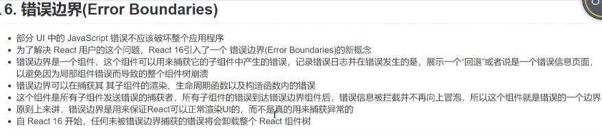

# React portals
- Portals 也叫插槽，提供了将子节点渲染到根节点以外的DOM中
```
 ReactDOM.createPortal(child,container);
```
- 其中child是任何可以渲染的React元素，组件，可以是div，Fragment
- container是需要挂载的根DOM元素

- index.html
```
  <!DOCTYPE html>
    <html>
    <head>
      <title></title>
    </head>
    <body>
      <div id='root'></div>
      <div id='modal-root'></div>
    </body>
    </html>
```
-  modal窗口代码
```
<!-- modal.css -->
  .modal{
      position: fixed;
      left:0;
      top:0;
      right:0;
      bottom:0;
      background-color: rgba(0,0,0,.5);
      display:flex;
      justify-content: center;
      align-items: center;
  }
  @keyframes zoom{
      from{transform:scale(0)}
      to{transform:scale(1)}
  }
  .content{
      width:50%;
      height:50%;
      background-color: #FFF;
      border-radius: 5px;
      display:flex;
      flex-direction: row;
      justify-content: center;
      align-items: center;
      animation: zoom .6s; 
  }
```
```
  import React, { Component } from 'react';
  import ReactDOM from 'react-dom';
  import './modal.css'
  class Modal extends Component {
    constructor(){
      super();
    }
    render(){
       return ReactDOM.createPortal(this.props.children,document.getElementById('modal-root'));
    }
  }

  export default class Page extends Component{
      constructor(){
          super();
          this.state = {showModal:false};
      }
      toggleModal = ()=>{
          this.setState({showModal:!this.state.showModal});
      }
      render(){
          return (
              <div>
                  <button onClick={this.toggleModal}>显示/关闭模态窗口</button>
                  {
                      this.state.showModal&&(
                          <Modal>
                              <div id="modal" className="modal">
                                  <div id="content" className="content"> 
                                      主体内容
                                      <button onClick={this.toggleModal}>关闭</button>    
                                  </div>
                              </div>
                          </Modal>
                      )
                  }
              </div>
          )
      }
  }
```

# React Error Boundaries


```
  import React,{Component} from 'react';

  class ErrorBoundary extends Component{
    constructor(){
          super();
          this.state = {hasErrors:false};
    }
    //此生命周期函数可以用来捕获错误和信息
    componentDidCatch(err,info){
        if(err){
          this.setState({
              hasErrors:true
          });
        }
     //Suspense 可用来实现同步网络请求并渲染
    }
    render(){
      if(this.state.hasErrors){
          return <div>子组件发生未知错误，无法正常显示</div>
      }
      return this.props.children;
    }
  }
  function Clock(){
      console.log(null.toString());
      return <div style={{border:'5px solid green',padding:'5px'}}>{Date.now()}</div>
  }
  function Counter(){
      return <div style={{border:'5px solid blue',padding:'5px'}}>计数器</div>
  }
  export default class Page extends Component{
      render(){
          return (
              <div style={{border:'5px solid red',padding:'5px'}}>
                  page
                  <ErrorBoundary>
                      <Clock/>
                  </ErrorBoundary>
                  <Counter/>
              </div>
             
          )
      }
  }
```