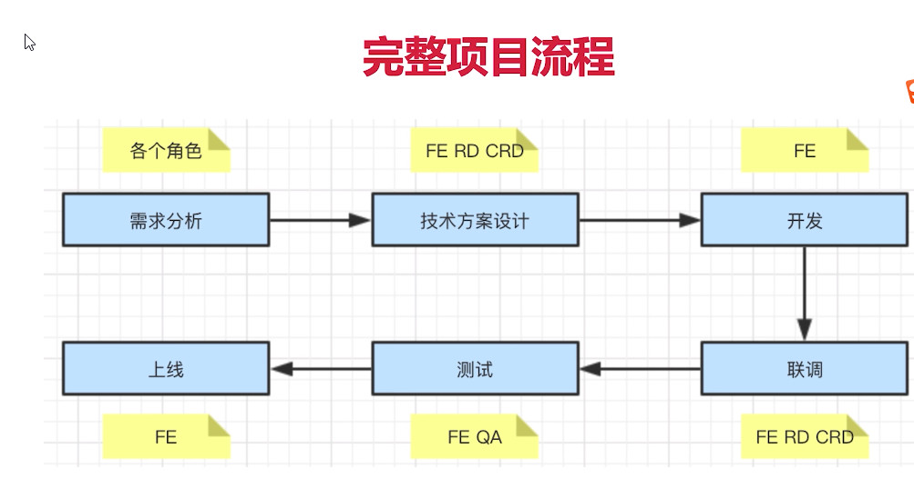

# 一个完整的项目流程图

## 
## 1、需求分析

1、了解背景

2、质疑需求是否合理（成本实际效果）例如加个复杂的动画

3、需求是否闭环(例如点赞 排序；比如分享 回流

4、开发难道如何

5、是否需要其他支持

6、不要急于给排期(最后开完会 再排)

## 2、技术方案设计

1、求简，不过度设计

2、产出文档(写得出就能写的除文档，保存记忆)

3、找准设计重

4、组内评审

5、和RD CRD沟通

6、发出会议结论

## 3、开发

1、如何反馈排期

2、符合开发规范

3、写出开发文档

4、及时单元测试

5、Mock API

6、code Review

## 4、联调

1、和RD CRD技术联调

2、让UE确定视觉效果

3、让PM 确定产品功能

## 5、测试

1、提测发邮件，抄送项目组

2、测试问题要详细记录

3、有问题及时沟通，QA和FE天生信息不对称

## 6、上线

1、上线后及时通知QA回归测试

2、上线之后及时同步给PM和项目组

3、如果有问题，及时回滚。先止损，再排查问题

# 项目沟通

1、多人协作，沟通是最重要的

2、每日一沟通(如站会)，有事说事，无事报平安

3、及时识别分享，及时汇报

​        
